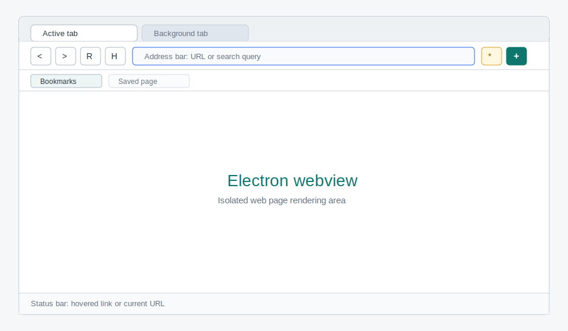
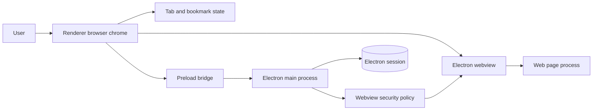
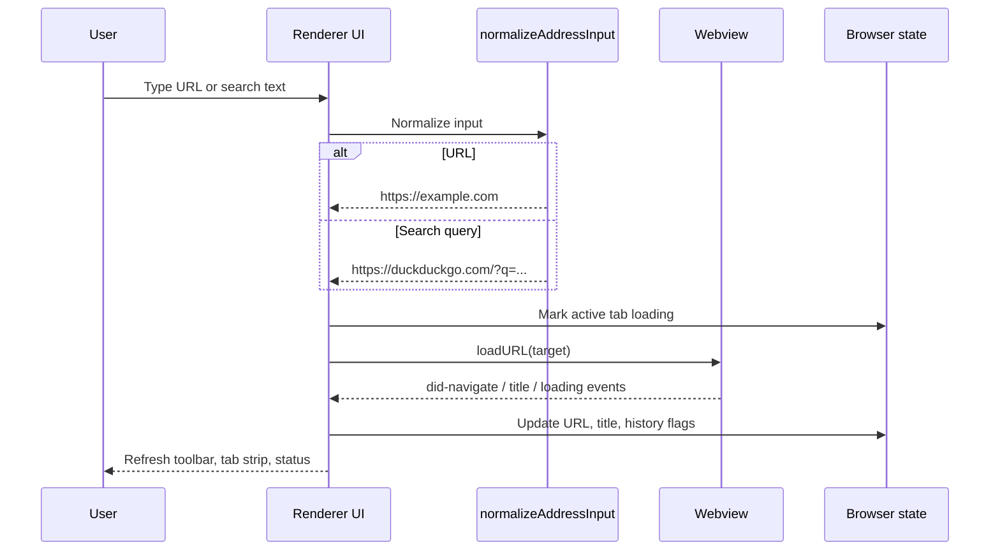

<p align="center">
  <a href="README.md"></a>
  <a href="docs/en/build-from-scratch.md"></a>
  <a href="docs/vi/xay-dung-tu-dau.md"></a>
</p>

<h1 align="center">Learn Web Browser Engineering</h1>

<p align="center"><strong>Một khóa học nhỏ theo dự án: xây dựng browser shell desktop bằng TypeScript, Electron, webview isolation, state management, verification và tài liệu song ngữ.</strong></p>

<p align="center">
  
  
  
  
</p>

> Guide này lấy cảm hứng về cách trình bày từ [`walkinglabs/learn-harness-engineering`](https://github.com/walkinglabs/learn-harness-engineering): có visual preview, quick start, learning path, project breakdown, sơ đồ ASCII/Mermaid và kiểm chứng rõ ràng. Nội dung bên dưới được viết riêng cho dự án browser này.

---

## Table of Contents

- [Visual Preview](#visual-preview)
- [Browser Shell Pattern](#browser-shell-pattern)
- [Quick Start](#quick-start)
- [Capstone Project](#capstone-project)
- [Learning Path](#learning-path)
- [Syllabus](#syllabus)
- [Verification](#verification)
- [Repository Structure](#repository-structure)

---

## Visual Preview

### Browser Chrome

> UI đầu tiên tập trung vào thao tác thật: tab strip, address bar, navigation controls, bookmark bar, webview stage và status bar.



### Runtime Architecture

> Renderer điều khiển browser chrome, Electron main process khóa chính sách an toàn, còn web content chạy trong vùng webview tách biệt.



### Navigation Flow

> Address bar không chỉ nhận URL. Nó phân loại input thành URL thật hoặc search query, rồi cập nhật state khi webview phát event.



---

## Browser Shell Pattern

Điểm quan trọng của dự án này: **ta không viết rendering engine từ đầu; ta xây browser shell từ đầu.** Chromium render trang web, còn code của dự án quyết định cách người dùng điều hướng, quản lý tab, lưu bookmark và kiểm soát an toàn.

```text
                    THE BROWSER SHELL PATTERN
                    =========================

    User --> Browser Chrome --> Pure State + Webview Controller --> Webview
                 |                         |                         |
                 |                         |                         v
                 |                         |                  Web page process
                 |                         |
                 v                         v
          Toolbar / tabs             tests can verify
          bookmarks / status         URL and tab behavior

    Electron main process governs:
    +--> Window creation
    +--> Webview attachment policy
    +--> Permission denial by default
    +--> Context isolation and Node isolation
```

Browser shell có năm phần chính:

- **Chrome UI**: tab strip, toolbar, address bar, bookmark bar, status bar.
- **Navigation**: biến input thành URL hoặc DuckDuckGo search URL.
- **State**: tab, active tab, loading state, history flags, bookmarks.
- **Isolation**: renderer không có Node trực tiếp; webview bị ép `nodeIntegration: false`.
- **Verification**: pure logic có unit test; app có build/typecheck/audit.

---

## Quick Start

Bạn chỉ cần Node.js và npm.

```bash
npm install
npm test
npm run typecheck
npm run build
npm run dev
```

`npm run dev` sẽ build Electron main process, chạy Vite renderer tại `http://127.0.0.1:5173/`, rồi mở Electron window `From Scratch Browser`.

---

## Capstone Project

Toàn bộ guide xoay quanh một sản phẩm duy nhất: **desktop web browser tối giản nhưng chạy thật**.

```text
    ┌──────────────────────────────────────────────────────────────┐
    │                  From Scratch Browser                        │
    │                                                              │
    │  ┌──────────────┐ ┌──────────────┐ ┌──────────────────────┐  │
    │  │ Active Tab   │ │ Other Tab    │ │ + New Tab            │  │
    │  └──────────────┘ └──────────────┘ └──────────────────────┘  │
    │                                                              │
    │  [<] [>] [R] [H]  https://example.com                 [*][+] │
    │                                                              │
    │  Bookmarks:  Docs  Search  Localhost                         │
    │                                                              │
    │  ┌────────────────────────────────────────────────────────┐  │
    │  │                                                        │  │
    │  │                 Electron webview                       │  │
    │  │             isolated web page content                   │  │
    │  │                                                        │  │
    │  └────────────────────────────────────────────────────────┘  │
    │                                                              │
    │  Status: hovered link or current URL                         │
    └──────────────────────────────────────────────────────────────┘

    Core features:
    ├── Navigate by URL or search query
    ├── Back / forward / reload / stop / home
    ├── Multiple tabs
    ├── Local bookmarks
    ├── Webview isolation
    └── Verification pipeline
```

---

## Learning Path

Nên đọc và thực hành theo thứ tự này.

```text
    Phase 1: FOUNDATION                    Phase 2: BROWSER LOGIC
    ====================                   ======================

    M01  Project scaffold                  M03  Address normalization
         TypeScript + Vite + Electron           URL vs search query

    M02  Electron process model            M04  Tab and bookmark state
         main / preload / renderer              pure functions + tests

             |                                      |
             v                                      v

    Phase 3: RUNTIME UI                    Phase 4: SAFETY & DOCS
    ===================                    ======================

    M05  Browser chrome                    M06  Verification and docs
         toolbar + tabs + webviews              test + typecheck + build

             |                                      |
             v                                      v

         Working desktop browser            Bilingual learning guide
```

---

## Syllabus

### Modules

| Module | Question | Output |
|--------|----------|--------|
| M01 | Làm sao scaffold desktop browser bằng TypeScript? | `package.json`, `tsconfig`, Vite configs |
| M02 | Electron chia main/preload/renderer như thế nào? | `src/main/main.ts`, `src/main/preload.ts` |
| M03 | Address bar nên hiểu input ra sao? | `src/shared/navigation.ts` + tests |
| M04 | Tab và bookmark nên được quản lý ở đâu? | `src/renderer/browserState.ts` + tests |
| M05 | UI điều khiển webview như thế nào? | `src/renderer/renderer.ts`, HTML, CSS |
| M06 | Khi nào được coi là xong? | test, typecheck, build, audit, launch |

### Project Milestones

| Milestone | What You Build | Evidence |
|-----------|----------------|----------|
| P01 | Core URL/search parser | `tests/navigation.test.ts` |
| P02 | Browser state reducer | `tests/browserState.test.ts` |
| P03 | Electron shell | `npm run build:main` |
| P04 | Renderer UI | `npm run build:renderer` |
| P05 | Documentation pack | `docs/en`, `docs/vi`, `docs/diagrams`, `docs/assets` |
| P06 | Full verification run | `npm test`, `npm run typecheck`, `npm run build`, `npm audit --omit=dev` |

---

## Verification

Không coi thay đổi là hoàn tất nếu chưa có bằng chứng chạy được.

```text
    VERIFICATION PIPELINE
    =====================

    npm test
      └── navigation + browser state behavior

    npm run typecheck
      └── TypeScript correctness

    npm run build
      ├── Electron main/preload bundle
      └── Renderer production bundle

    npm audit --omit=dev
      └── Runtime dependency vulnerability check

    npm run dev
      └── Smoke test: Electron window opens
```

Các tài liệu chi tiết:

- [English build guide](./docs/en/build-from-scratch.md)
- [Hướng dẫn tiếng Việt](./docs/vi/xay-dung-tu-dau.md)
- [Architecture diagram source](./docs/diagrams/architecture.mmd)
- [Navigation flow source](./docs/diagrams/navigation-flow.mmd)
- [Build process source](./docs/diagrams/build-process.mmd)

---

## Repository Structure

```text
web-browser/
├── src/
│   ├── main/                 # Electron main process and preload bridge
│   ├── renderer/             # Browser chrome UI, state, styles
│   └── shared/               # Reusable pure logic
├── tests/                    # Vitest unit tests
├── docs/
│   ├── en/                   # English guide
│   ├── vi/                   # Vietnamese guide
│   ├── diagrams/             # Mermaid source files
│   ├── assets/               # SVG illustrations
│   └── superpowers/          # Design and implementation records
├── package.json
├── tsconfig.json
├── vite.main.config.ts
├── vite.renderer.config.ts
└── vitest.config.ts
```

---

## License

MIT

