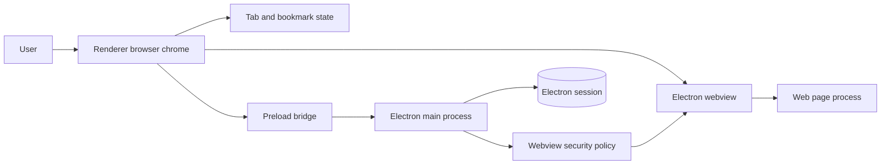
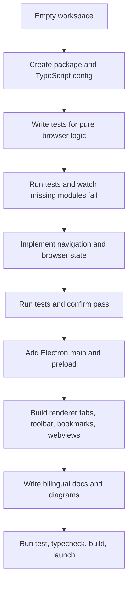
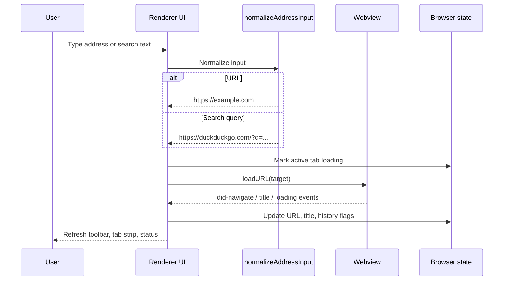

# Build a Web Browser From Scratch

This project is a small desktop browser built with TypeScript and Electron. It does not build a rendering engine from zero; it builds the browser shell from zero and uses Chromium through Electron for page rendering.


## What You Get

- A desktop app with tabs, address/search bar, back, forward, reload/stop, home, bookmarks, and a status bar.
- Isolated web content through Electron `<webview>`.
- Testable TypeScript modules for address parsing and tab/bookmark state.
- English and Vietnamese documentation plus diagram sources.

## Architecture



The same diagram is stored in [`../diagrams/architecture.mmd`](../diagrams/architecture.mmd).

## Project Structure

```text
src/
  main/
    main.ts        Electron startup, window creation, webview security policy
    preload.ts     Narrow bridge exposed to the renderer
  renderer/
    browserState.ts Pure tab and bookmark state
    index.html      Browser chrome shell
    renderer.ts     DOM events, webview lifecycle, shortcuts
    styles.css      UI styling
  shared/
    navigation.ts   Address/search normalization
tests/
  browserState.test.ts
  navigation.test.ts
docs/
  en/
  vi/
  diagrams/
  assets/
```

## Build Process



## Navigation Flow



## How It Was Built

1. Create the TypeScript project files: `package.json`, `tsconfig.json`, Vite configs, Vitest config, and `.gitignore`.
2. Write tests first for `normalizeAddressInput` and browser state reducers.
3. Run `npm test` and confirm the tests fail because the modules do not exist.
4. Implement `src/shared/navigation.ts` and `src/renderer/browserState.ts`.
5. Run `npm test` again and confirm all core tests pass.
6. Add Electron `main.ts` with a secure `BrowserWindow` and webview policy.
7. Add `preload.ts` so the renderer can receive only safe environment details.
8. Build the renderer UI: tab strip, toolbar, address form, bookmark bar, webview stage, and status bar.
9. Add documentation, Mermaid diagram sources, and the SVG wireframe.

## Commands

```bash
npm install
npm test
npm run typecheck
npm run build
npm run dev
```

Use `npm run dev` while developing. Use `npm run build` then `npm start` to run the built app.

## Security Notes

- The main browser chrome disables Node integration.
- Web content is hosted inside Electron webviews.
- Attached webviews are forced to use `nodeIntegration: false`, `contextIsolation: true`, and `sandbox: true`.
- Permission requests are denied by default because this is an educational browser.
- Target-blank windows are denied by the main process.

## Current Limits

- No extension API.
- No password manager.
- No sync or multiple profiles.
- No packaged installer or code signing.
- Bookmarks are stored locally in renderer `localStorage`.

