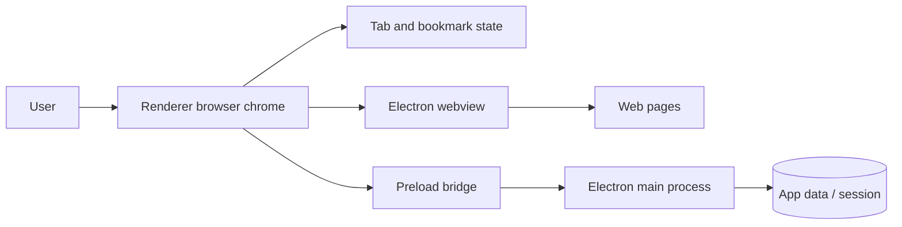

# Web Browser From Scratch Design

## Context

The workspace is empty and is not a Git repository. The project will be created from scratch as a TypeScript desktop browser using Electron. The user asked for completion without follow-up questions, so this design uses conservative defaults.

## Goals

- Build a working desktop web browser shell.
- Use TypeScript throughout the application code.
- Support common browser actions: address/search input, back, forward, reload/stop, home, new tab, close tab, tab switching, bookmarks, and status text.
- Keep web content isolated from the application UI.
- Include automated tests for core browser logic.
- Include bilingual documentation in English and Vietnamese with diagrams and illustrations.

## Non-Goals

- Building a Chromium engine from scratch.
- Browser extension support.
- Full password manager, sync, profiles, or devtools integration beyond Electron defaults.
- Production code signing or packaged installers.

## Architecture

The browser is an Electron application with a main process, a preload bridge, and a renderer UI.

## Components

- `src/main/main.ts`: starts Electron, configures the browser window, and locks down webview attachment settings.
- `src/main/preload.ts`: exposes a narrow, typed bridge from the isolated renderer to Electron APIs.
- `src/shared/navigation.ts`: converts address-bar input into either a URL or a search URL.
- `src/renderer/browserState.ts`: pure tab reducer and bookmark helpers.
- `src/renderer/renderer.ts`: DOM wiring for tabs, toolbar controls, webviews, and bookmarks.
- `src/renderer/index.html` and `src/renderer/styles.css`: browser chrome layout and visual system.
- `tests/*.test.ts`: unit tests for navigation and state behavior.
- `docs/en` and `docs/vi`: bilingual build guides.
- `docs/diagrams` and `docs/assets`: Mermaid sources and SVG illustrations.

## Data Flow

1. The user types text into the address bar.
2. The renderer calls `normalizeAddressInput`.
3. If the input is a URL, the active webview navigates there.
4. If the input is search text, the active webview navigates to DuckDuckGo search.
5. Webview events update tab title, URL, loading state, navigation buttons, and status text.
6. Bookmarks are saved in renderer `localStorage` as a small JSON list.

## Security

- Main window uses `contextIsolation: true` and `nodeIntegration: false`.
- Renderer uses a preload bridge instead of direct Node access.
- Attached webviews are forced to disable Node integration and use context isolation.
- Permission requests from web content are denied by default for this educational browser.
- External new-window requests open as new browser tabs instead of arbitrary windows.

## Testing

Automated tests cover:

- URL normalization for protocols, localhost, domains, paths, search queries, and invalid whitespace.
- Tab state transitions: create, close, select, navigate, title update, loading state, and navigation ability flags.
- Bookmark add/remove behavior and duplicate prevention.

Manual verification covers:

- `npm run build`
- `npm test`
- Launching Electron with `npm run dev`

