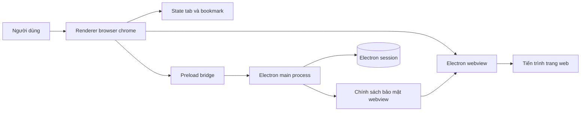
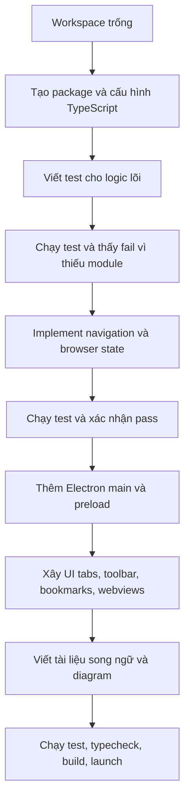
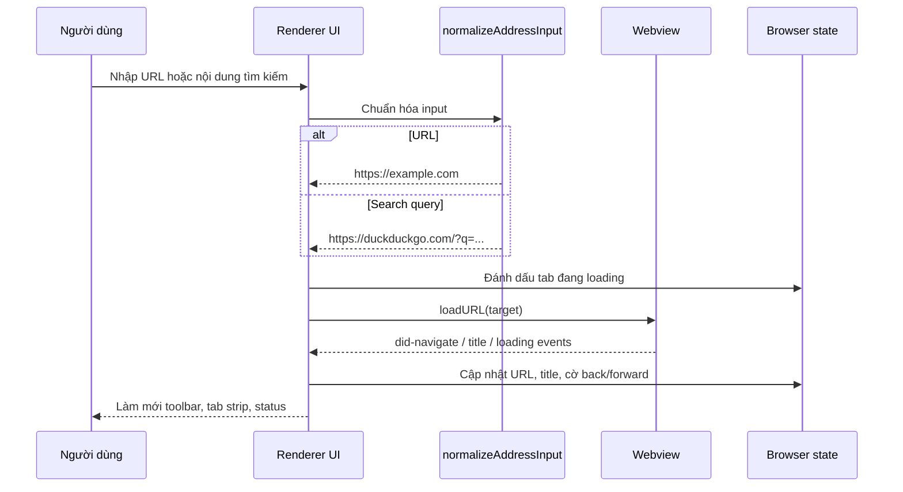

# Xây Dựng Web Browser Từ Đầu

Dự án này là một trình duyệt desktop nhỏ được viết bằng TypeScript và Electron. Dự án không viết lại rendering engine từ con số không; thay vào đó, nó xây dựng browser shell từ đầu và dùng Chromium thông qua Electron để render trang web.


## Kết Quả

- Ứng dụng desktop có tab, thanh địa chỉ/tìm kiếm, back, forward, reload/stop, home, bookmark và status bar.
- Nội dung web được tách riêng bằng Electron `<webview>`.
- Module TypeScript dễ test cho xử lý address bar và state tab/bookmark.
- Tài liệu tiếng Anh, tiếng Việt, kèm diagram và minh họa.

## Kiến Trúc



File Mermaid gốc nằm ở [`../diagrams/architecture.mmd`](../diagrams/architecture.mmd).

## Cấu Trúc Dự Án

```text
src/
  main/
    main.ts        Khởi động Electron, tạo window, khóa cấu hình webview
    preload.ts     Bridge nhỏ và an toàn cho renderer
  renderer/
    browserState.ts State tab và bookmark dạng pure function
    index.html      Khung browser chrome
    renderer.ts     DOM event, vòng đời webview, shortcut
    styles.css      Giao diện
  shared/
    navigation.ts   Chuẩn hóa URL hoặc search query
tests/
  browserState.test.ts
  navigation.test.ts
docs/
  en/
  vi/
  diagrams/
  assets/
```

## Quy Trình Xây Dựng



## Luồng Điều Hướng



## Các Bước Đã Làm

1. Tạo các file TypeScript project: `package.json`, `tsconfig.json`, Vite config, Vitest config và `.gitignore`.
2. Viết test trước cho `normalizeAddressInput` và reducer state của browser.
3. Chạy `npm test` để thấy test fail vì module chưa tồn tại.
4. Implement `src/shared/navigation.ts` và `src/renderer/browserState.ts`.
5. Chạy lại `npm test` để xác nhận logic lõi pass.
6. Thêm Electron `main.ts` với `BrowserWindow` và chính sách webview an toàn.
7. Thêm `preload.ts` để renderer chỉ nhận một bridge nhỏ, không có Node trực tiếp.
8. Xây UI renderer: tab strip, toolbar, address form, bookmark bar, webview stage và status bar.
9. Thêm tài liệu song ngữ, Mermaid diagram và SVG wireframe.

## Lệnh Sử Dụng

```bash
npm install
npm test
npm run typecheck
npm run build
npm run dev
```

Dùng `npm run dev` khi phát triển. Dùng `npm run build` rồi `npm start` để chạy bản đã build.

## Ghi Chú Bảo Mật

- Browser chrome tắt Node integration.
- Nội dung web nằm trong Electron webview.
- Webview bị ép dùng `nodeIntegration: false`, `contextIsolation: true` và `sandbox: true`.
- Yêu cầu quyền từ trang web bị từ chối theo mặc định vì đây là browser phục vụ học tập.
- Cửa sổ target-blank bị main process chặn.

## Giới Hạn Hiện Tại

- Chưa có extension API.
- Chưa có password manager.
- Chưa có sync hoặc nhiều profile.
- Chưa đóng gói installer và chưa code signing.
- Bookmark được lưu cục bộ trong `localStorage` của renderer.

